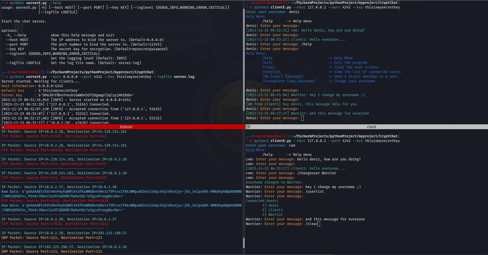

# **CryptChat**: Beyond Secure Messaging 🛡️



Welcome to **CryptChat** - where conversations remain truly private. Built on the robust Python ecosystem, our application ensures that every word you send is wrapped in layers of encryption. Whether you're discussing sensitive business details or sharing personal stories, **CryptChat** provides the sanctuary you need in the digital age. Dive in, and experience the next level of secure messaging!

---

## Features of **CryptChat** 🌟

1. **End-to-End Encryption**: Every message is secured from sender to receiver, ensuring utmost privacy.
2. **User-Friendly Interface**: Navigating and messaging is intuitive and simple, making secure conversations a breeze.
3. **Multi-Platform Support**: Whether on a desktop or mobile device, **CryptChat** is always at your fingertips.
4. **Robust Backend**: Built on the powerful Python ecosystem, our chat is reliable and fast.
5. **Open Source**: Dive into our codebase, contribute, and make it even better for everyone.
6. **Multimedia Support**: Not just text - send encrypted images, videos, and files with ease. (Demo)
7. **Group Chats**: Have encrypted conversations with multiple people at once.
8. **Adaptive Encryption Modes**: Choose between unencrypted and encrypted chat modes as per your need

---

## Requirements

- Python 3.x
- cryptography
- colorama

## Installation

1. Clone the repository:

   ```shell
   git clone https://github.com/HalilDeniz/CryptoChat.git
   ```

2. Navigate to the project directory:

   ```shell
   cd CryptoChat
   ```

3. Install the required dependencies:

   ```shell
   pip install -r requirements.txt
   ```
---   

## Usage 🚀
#### unencrypted version

   ```shell
$ python3 server.py --help
usage: server.py [-h] [--host HOST] [--port PORT] [--loglevel {DEBUG,INFO,WARNING,ERROR,CRITICAL}] [--logfile LOGFILE]

Start the chat server.

options:
  -h, --help            show this help message and exit
  --host HOST           The IP address to bind the server to. (Default: 0.0.0.0)
  --port PORT           The port number to bind the server to. (Default: 12345)
  --loglevel {DEBUG,INFO,WARNING,ERROR,CRITICAL}
                        Set the logging level (Default: INFO)
  --logfile LOGFILE     Set the log file name. (Default: server.log
--------------------------------------------------------------------------
$ python3 client.py --help
usage: client.py [-h] [--host HOST] [--port PORT]

Connect to the chat server.

options:
  -h, --help   show this help message and exit
  --host HOST  The server's IP address.
  --port PORT  The port number of the server.
   ```

#### The encrypted version

```shell
$ python3 serverE.py --help
usage: serverE.py [-h] [--host HOST] [--port PORT] [--key KEY] [--loglevel {DEBUG,INFO,WARNING,ERROR,CRITICAL}] [--logfile LOGFILE]

Start the chat server.

options:
  -h, --help            show this help message and exit
  --host HOST           The IP address to bind the server to. (Default=0.0.0.0)
  --port PORT           The port number to bind the server to. (Default=12345)
  --key KEY             The secret key for encryption. (Default=mysecretpassword)
  --loglevel {DEBUG,INFO,WARNING,ERROR,CRITICAL}
                        Set the logging level (Default: INFO)
  --logfile LOGFILE     Set the log file name. (Default: server.log)
--------------------------------------------------------------------------
$ python3 clientE.py --help
usage: clientE.py [-h] [--host HOST] [--port PORT] [--key KEY]

Connect to the chat server.

options:
  -h, --help   show this help message and exit
  --host HOST  The IP address to bind the server to. (Default=127.0.0.1)
  --port PORT  The port number to bind the server to. (Default=12345)
  --key KEY    The secret key for encryption. (Default=mysecretpassword)
```

- `--help`    : show this help message and exit
- `--host`    : The IP address to bind the server.
- `--port`    : The port number to bind the server.
- `--key `    : The secret key for encryption
- `--loglevel`: Set the logging level
- `--logfile` : Set the log file name

## An example work from within the program
```shell
python3 clientE.py 
Enter your username: deniz
Help Menu:
	/help       -> Help menu
deniz: Enter your message: /help
deniz: Enter your message: 
Help Menu:
	/help                           -> Help Menu
	/exit                           -> Exit the program.
	/userlist                       -> View the list of connected users.
	/dm [user] [message]            -> Send a direct message to a user.
	/changeuser [new_username]      -> Change your username.

deniz: Enter your message: 
[2023-10-30 07:38:18] denizhalil: hello im denizhalil
deniz: Enter your message: Hello denizhalil, it's deniz
deniz: Enter your message: /changeuser Warrior
Username changed to Warrior.
Warrior: Enter your message: 
```

## Listener
I wrote a listening [**tool**](https://denizhalil.com/2023/10/17/decrypting-encrypted-network-traffic-python-scapy) to see if encrypted messaging is working correctly
```shell
└─# python3 SCsniff.py 
IP Packet: Source IP=127.0.0.1, Destination IP=127.0.0.1
TCP Packet: Source Port=12345, Destination Port=50968
Raw Data: b'gAAAAABlOlxawZboULf0WJkQQkzVwJKLXbGh3qyxWYbaCqNhi5xLwhR9YdckSiPiPQCkWHHGSzKAKG5pW3HyatQnpekoR0Zl-_DH-WH_azjGm86QGW1PRnE='
--------------------------------------------------
IP Packet: Source IP=127.0.0.1, Destination IP=127.0.0.1
TCP Packet: Source Port=12345, Destination Port=50968
Raw Data: b'gAAAAABlOlxawZboULf0WJkQQkzVwJKLXbGh3qyxWYbaCqNhi5xLwhR9YdckSiPiPQCkWHHGSzKAKG5pW3HyatQnpekoR0Zl-_DH-WH_azjGm86QGW1PRnE='
--------------------------------------------------
IP Packet: Source IP=127.0.0.1, Destination IP=127.0.0.1
TCP Packet: Source Port=50968, Destination Port=12345
--------------------------------------------------
TCP Packet: Source Port=42228, Destination Port=12345
Raw Data: b'gAAAAABlOlyHDfYapDc2kawoEjNozSJybZBk0SxZwMiE2_x9OffGGc-NlaB3FHJue6jY3rQbBKseCkDATpnBgJRxLJQA6heDlw=='
--------------------------------------------------
IP Packet: Source IP=127.0.0.1, Destination IP=127.0.0.1
TCP Packet: Source Port=42228, Destination Port=12345
Raw Data: b'gAAAAABlOlyHDfYapDc2kawoEjNozSJybZBk0SxZwMiE2_x9OffGGc-NlaB3FHJue6jY3rQbBKseCkDATpnBgJRxLJQA6heDlw=='
--------------------------------------------------
IP Packet: Source IP=127.0.0.1, Destination IP=127.0.0.1
TCP Packet: Source Port=12345, Destination Port=42228
Raw Data: b'gAAAAABlOlyHyCO4dV50WtplQ8eZxbH8d9xuL04iGsrbjhU-oFlguaaig0vjRd7GVvLiBm5Js6kFYHpc6esuTkDrmabq-k1DdSrlEHOgvdaMotxMMg5KEL8='
--------------------------------------------------
IP Packet: Source IP=127.0.0.1, Destination IP=127.0.0.1
TCP Packet: Source Port=12345, Destination Port=42228
Raw Data: b'gAAAAABlOlyHyCO4dV50WtplQ8eZxbH8d9xuL04iGsrbjhU-oFlguaaig0vjRd7GVvLiBm5Js6kFYHpc6esuTkDrmabq-k1DdSrlEHOgvdaMotxMMg5KEL8='
--------------------------------------------------

IP Packet: Source IP=127.0.0.1, Destination IP=127.0.0.1
TCP Packet: Source Port=42228, Destination Port=12345
Raw Data: b'gAAAAABlOlyPKyzTR_-1LFSNLtBCR5sghmont3299N9QWrQhHXzwo1Y-toax3Xh4f3PQ5cG-8QuOpM9ApGFoxkVGbpH4Bfhy9iYduQgwYy59kChiGwIQ1rI='
--------------------------------------------------
IP Packet: Source IP=127.0.0.1, Destination IP=127.0.0.1
TCP Packet: Source Port=42228, Destination Port=12345
Raw Data: b'gAAAAABlOlyPKyzTR_-1LFSNLtBCR5sghmont3299N9QWrQhHXzwo1Y-toax3Xh4f3PQ5cG-8QuOpM9ApGFoxkVGbpH4Bfhy9iYduQgwYy59kChiGwIQ1rI='
--------------------------------------------------
```

## Contributing

Contributions are welcome! If you find any issues or have suggestions for improvements, feel free to open an issue or submit a pull request.

## Contact

If you have any questions, comments, or suggestions about CryptChat, please feel free to contact me:

- LinkedIn: [Halil Ibrahim Deniz](https://www.linkedin.com/in/halil-ibrahim-deniz/)
- TryHackMe: [Halilovic](https://tryhackme.com/p/halilovic)
- Instagram: [deniz.halil333](https://www.instagram.com/deniz.halil333/)
- YouTube: [Halil Deniz](https://www.youtube.com/c/HalilDeniz)
- Email: halildeniz313@gmail.com

## License
This project is licensed under the MIT License. See the [LICENSE](LICENSE) file for more details.

## 💰 You can help me by Donating
  Thank you for considering supporting me! Your support enables me to dedicate more time and effort to creating useful tools like CryptoChat and developing new projects. By contributing, you're not only helping me improve existing tools but also inspiring new ideas and innovations. Your support plays a vital role in the growth of this project and future endeavors. Together, let's continue building and learning. Thank you!"<br>
  [](https://buymeacoffee.com/halildeniz) 
  [](https://patreon.com/denizhalil) 

  
