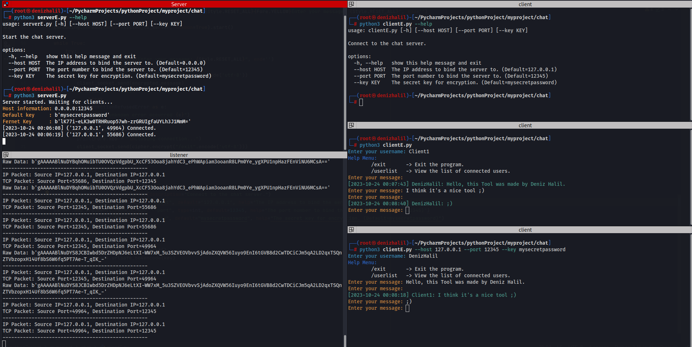

# **CryptChat**: Beyond Secure Messaging 🛡️



Welcome to **CryptChat** - where conversations remain truly private. Built on the robust Python ecosystem, our application ensures that every word you send is wrapped in layers of encryption. Whether you're discussing sensitive business details or sharing personal stories, **CryptChat** provides the sanctuary you need in the digital age. Dive in, and experience the next level of secure messaging!

---

## Features of **CryptChat** 🌟

1. **End-to-End Encryption**: Every message is secured from sender to receiver, ensuring utmost privacy.
2. **User-Friendly Interface**: Navigating and messaging is intuitive and simple, making secure conversations a breeze.
4. **Robust Backend**: Built on the powerful Python ecosystem, our chat is reliable and fast.
5. **Open Source**: Dive into our codebase, contribute, and make it even better for everyone.
6. **Multimedia Support**: Not just text - send encrypted images, videos, and files with ease.
7. **Group Chats**: Have encrypted conversations with multiple people at once.

---

## Requirements

- Python 3.x
- cryptography
- colorama

## Installation

1. Clone the repository:

   ```shell
   git clone https://github.com/HalilDeniz/CryptoChat.git
   ```

2. Navigate to the project directory:

   ```shell
   cd CryptoChat
   ```

3. Install the required dependencies:

   ```shell
   pip install -r requirements.txt
   ```
---   

## Usage 🚀
#### unencrypted version

   ```shell
$ python3 server.py --help
usage: server.py [-h] [--host HOST] [--port PORT]

Start the chat server.

options:
  -h, --help   show this help message and exit
  --host HOST  The IP address to bind the server to.
  --port PORT  The port number to bind the server to.
--------------------------------------------------------------------------
$ python3 client.py --help
usage: client.py [-h] [--host HOST] [--port PORT]

Connect to the chat server.

options:
  -h, --help   show this help message and exit
  --host HOST  The server's IP address.
  --port PORT  The port number of the server.
   ```

#### The encrypted version

```shell
$ python3 serverE.py --help
usage: serverE.py [-h] [--host HOST] [--port PORT] [--key KEY]

Start the chat server.

options:
  -h, --help   show this help message and exit
  --host HOST  The IP address to bind the server to. (Default=0.0.0.0)
  --port PORT  The port number to bind the server to. (Default=12345)
  --key KEY    The secret key for encryption. (Default=mysecretpassword)
--------------------------------------------------------------------------
$ python3 clientE.py --help
usage: clientE.py [-h] [--host HOST] [--port PORT] [--key KEY]

Connect to the chat server.

options:
  -h, --help   show this help message and exit
  --host HOST  The IP address to bind the server to. (Default=127.0.0.1)
  --port PORT  The port number to bind the server to. (Default=12345)
  --key KEY    The secret key for encryption. (Default=mysecretpassword)
```

- `--help`: show this help message and exit
- `--host`: The IP address to bind the server.
- `--port`: The port number to bind the server.
- `--key `: The secret key for encryption

## Contributing

Contributions are welcome! If you find any issues or have suggestions for improvements, feel free to open an issue or submit a pull request.

## Contact

If you have any questions, comments, or suggestions about CryptChat, please feel free to contact me:

- LinkedIn: [Halil Ibrahim Deniz](https://www.linkedin.com/in/halil-ibrahim-deniz/)
- TryHackMe: [Halilovic](https://tryhackme.com/p/halilovic)
- Instagram: [deniz.halil333](https://www.instagram.com/deniz.halil333/)
- YouTube: [Halil Deniz](https://www.youtube.com/c/HalilDeniz)
- Email: halildeniz313@gmail.com

## License
This project is licensed under the MIT License. See the [LICENSE](LICENSE) file for more details.

## 💰 You can help me by Donating
  Thank you for considering supporting me! Your support enables me to dedicate more time and effort to creating useful tools like CryptoChat and developing new projects. By contributing, you're not only helping me improve existing tools but also inspiring new ideas and innovations. Your support plays a vital role in the growth of this project and future endeavors. Together, let's continue building and learning. Thank you!"<br>
  [](https://buymeacoffee.com/halildeniz) 
  [](https://patreon.com/denizhalil) 

  
